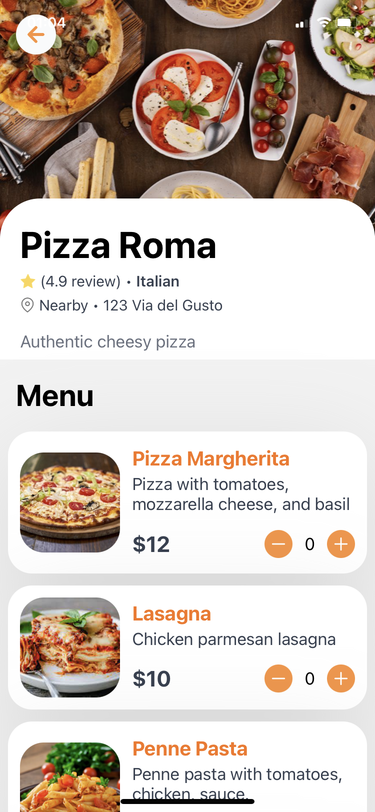

## food-delivery app

Fullstack mobile application developed for both IOS and Android platform.
The app offers a pretty good search functionality, allowing users to search for dishes by name and categories.
Users have the flexibility to select dishes from various menus, add them to the cart and place orders.
The menu items are managed and updated through the Sanity Studio.

### Home screen

###

###

### Technologies

- React Native
- Expo
- JavaScript
- React Navigation
- React Native Maps
- React Native Feather
- Sanity
- Tailwind
- NativeWind
